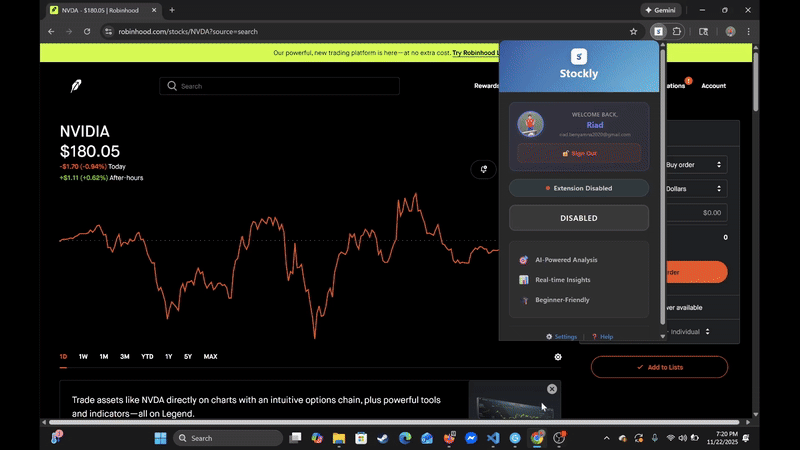

<div align="center">


# Stockly

**AI-powered stock & crypto analysis for Robinhood traders**


[Demo](#demo) • [Features](#features) • [Installation](#installation) • [Backend Repo](https://github.com/yourusername/stockly-backend)

</div>

---

## Demo

<div align="center">



*Real-time AI analysis integrated directly into Robinhood*

</div>

## Features

**🤖 AI-Powered Insights**
- GPT-4 market analysis via OpenRouter
- Real-time sentiment scoring from news sources
- Technical indicators and trend detection

**📊 Live Market Data**
- Stock prices from Alpha Vantage
- Cryptocurrency data from CoinGecko
- Breaking news via NewsAPI

**🔐 Secure by Design**
- Google OAuth 2.0 authentication
- Token-based API authorization
- No browsing or trading data collected

**⚡ Seamless Integration**
- Works directly on Robinhood.com
- Auto-detects stock tickers
- Clean, non-intrusive overlay

## Installation

### From Source

```bash
# Clone the repository
git clone https://github.com/yourusername/stockly-extension.git
cd stockly-extension

# Install dependencies
npm install
```

### Load in Chrome

1. Open `chrome://extensions/`
2. Enable **Developer mode** (top right)
3. Click **Load unpacked**
4. Select the `stockly-extension` folder
5. Pin the extension and sign in with Google

### Configuration

Create a `.env` file using the template:

```bash
cp .env.example .env
```

Update with your backend URL:

```env
API_BASE_URL=https://your-backend.railway.app
GOOGLE_CLIENT_ID=your-client-id.apps.googleusercontent.com
```

## Usage

**On Robinhood:**
1. Navigate to any stock page (e.g., `robinhood.com/stocks/AAPL`)
2. Extension auto-detects the ticker
3. Click the **Analyze** button
4. View AI-generated insights

**Anywhere else:**
- Highlight a ticker symbol (e.g., "TSLA")
- Right-click → **Analyze with Stockly**

## Tech Stack

<table>
<tr>
<td>

**Frontend**
- Chrome Extension (Manifest V3)
- Vanilla JavaScript
- HTML/CSS

</td>
<td>

**Backend** ([repo](https://github.com/yourusername/stockly-backend))
- Node.js + Express
- PostgreSQL
- Railway hosting

</td>
<td>

**APIs**
- OpenRouter (GPT-4)
- Alpha Vantage
- NewsAPI
- CoinGecko

</td>
</tr>
</table>

## Architecture

```
┌──────────────────────┐
│  Chrome Extension    │
│  content-script.js   │
│  popup.js            │
└──────────┬───────────┘
           │
           │ POST /analyze
           │ POST /auth/google
           ▼
┌──────────────────────┐
│  Express API         │
│  (Railway)           │
└──────────┬───────────┘
           │
           ├──► PostgreSQL
           ├──► OpenRouter (AI)
           ├──► Alpha Vantage
           ├──► NewsAPI
           └──► CoinGecko
```

## Project Structure

```
stockly-extension/
├── manifest.json          # Extension configuration
├── content-script.js      # Robinhood page integration
├── popup.html            # Extension popup UI
├── popup.js              # Popup logic
├── popup.css             # Styling
├── Stockly_Logo.png      # Brand assets
├── stocklydemo.gif       # Demo video
├── .env.example          # Config template
└── stockly-landing/      # OAuth landing page
```

## Development

### Local Setup

```bash
# Start the backend locally
cd stockly-backend
npm install
npm start
```

Update API endpoint:
```javascript
// In your config
const API_BASE_URL = 'http://localhost:8080';
```

Reload extension:
- Go to `chrome://extensions/`
- Click reload icon on Stockly

### Debugging

- **Content script**: Open DevTools on Robinhood page
- **Service worker**: `chrome://extensions/` → Inspect views
- **Popup**: Right-click extension icon → Inspect

## API Integration

### Authentication

```javascript
// User authenticates with Google
const response = await fetch(`${API_BASE_URL}/auth/google`, {
  method: 'POST',
  headers: { 'Content-Type': 'application/json' },
  body: JSON.stringify({ idToken: googleToken })
});

const { user } = await response.json();
// Store user.token for subsequent requests
```

### Stock Analysis

```javascript
// Analyze a ticker
const response = await fetch(`${API_BASE_URL}/analyze`, {
  method: 'POST',
  headers: { 'Content-Type': 'application/json' },
  body: JSON.stringify({
    ticker: 'AAPL',
    isCrypto: false,
    token: userToken
  })
});

const { result } = await response.json();
// result contains formatted HTML analysis
```

## Security

- All requests authenticated via JWT tokens
- User credentials encrypted in PostgreSQL
- HTTPS-only communication
- Rate limiting on backend
- No sensitive data stored in extension

**Permissions:**
- `activeTab` - Detect tickers on current page
- `storage` - Save auth tokens locally
- `identity` - Google OAuth
- `host_permissions` - Inject UI on Robinhood

## Roadmap

- [ ] Support for TD Ameritrade, E*TRADE
- [ ] Portfolio tracking dashboard
- [ ] Price alerts and notifications
- [ ] Options analysis with Greeks
- [ ] Historical performance charts
- [ ] Community sentiment integration

## Contributing

Contributions welcome! Please:

1. Fork the repository
2. Create a feature branch (`git checkout -b feature/amazing`)
3. Commit changes (`git commit -m 'Add feature'`)
4. Push to branch (`git push origin feature/amazing`)
5. Open a Pull Request

## License

MIT License - see [LICENSE](LICENSE) for details

## Disclaimer

**Educational purposes only.** Stockly is not financial advice. All investments carry risk of loss. Past performance does not guarantee future results. Consult qualified financial advisors before making investment decisions.

## Authors

<table>
<tr>
<td align="center">
<br />
<sub><b>Riad Benyamna</b></sub><br />
Computer Science @ USM<br />
Graduating May 2027<br />
<a href="mailto:riad.benyamna2020@gmail.com">📧 Email</a> •
<a href="https://linkedin.com/in/riad-benyamna">💼 LinkedIn</a> •
<a href="https://github.com/Jinmamak">💻 GitHub</a>
</td>
<td align="center">
<br />
<sub><b>Hossam Darwish</b></sub><br />
<br />
<br />
<a href="mailto:Hossam_ElZarw@outlook.com">📧 Email</a> •
<a href="https://www.linkedin.com/in/hossamdarwish/">💼 LinkedIn</a>
</td>
</tr>
</table>

---

<div align="center">

**Built at USM** • **Powered by AI** • **Made for Traders**

⭐ Star this repo if you find it useful!

</div>
